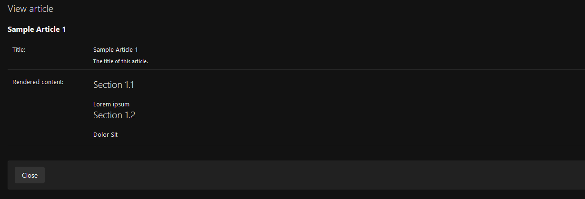

# Django Object Lock

>   Oops! I think I've edited the wrong object.
>   
>   We don't need to edit this any longer. I wish I could prevent this object from being edited anymore...

**Django Object Lock** (`django-object-lock`) adds a "locked" status to your models to prevent their unintentional
modification or deletion from your Django admin site, your API or any view. You can "lock" an instance to protect it
and then "unlock" it to allow further modifications or deletions.

Check out the [documentation](https://django-object-lock.readthedocs.io/) for more information.


## Features

*   A lock icon will appear in the changelist for each locked instance.

    

    The detail page for a locked object will be read-only.

    

*   This "locked" status may be set manually (adding a field for your users to lock or unlock the object) or
    automatically (locking objects depending on a condition).

    For example, you can have a parent model that can be locked setting manually a Boolean field and a child model
    that will be automatically locked or unlocked whenever its parent is.

    

    This way, you can lock and unlock entire hierarchies of model instances.


## Support

`django-object-lock` is tested with the following versions of Python and Django:

*   Python >= 3.11
*   Django >= 4.1
*   Django REST Framework >= 3.14 (to enforce object locking from your API generic views and viewsets)

Django is the only required dependency.


## Development instructions

You can find a demo project and a test suite in the `demo` directory.

The demo project contains three lockable models:

*   an `Article` model,
*   a child `ArticleSection` model, and
*   a `NotLockedModel` that is registered in the admin as a lockable model, but it does not have locking logic.

You will need to install development dependencies in your Python environment:

```sh
pip install -r requirements-dev.txt
```

Then, run the demo application:

```sh
cd demo && python manage.py runserver
```

Or run tests with Tox:

```sh
# Test for Python 3.12 and Django 4.2.
tox -e py3.12-django4.2

# Generate a coverage report.
tox -e coverage

# Check PEP8 compliance.
tox -e flake8
```
