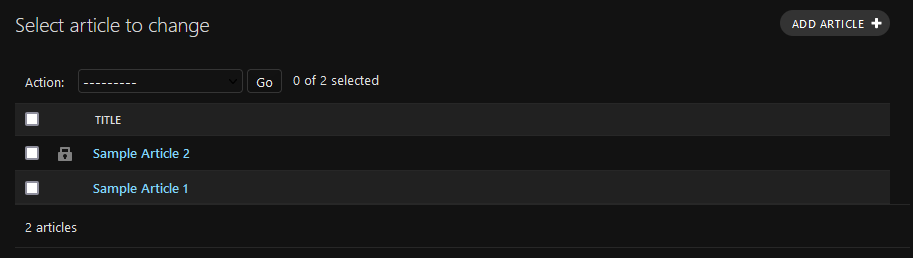
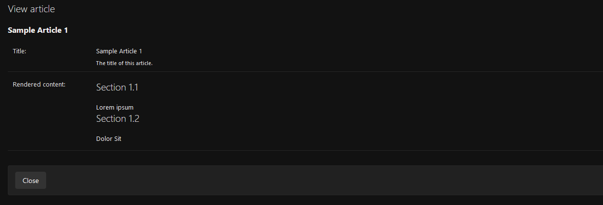
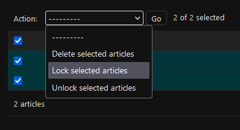
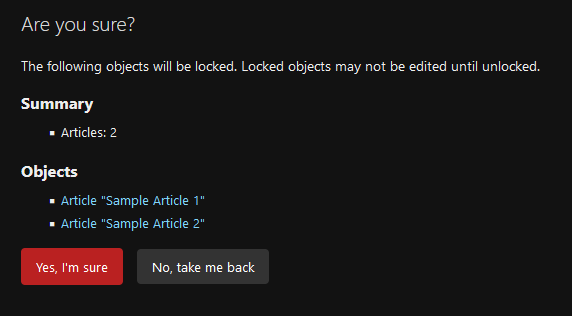

# Admin-level locking

Admin-level locking prevents edition or deletion of your model instances from the admin, but not necessarily from any
other part of your Django project.

To apply admin-level locking, your admin class will inherit from `LockableAdminMixin`. The model you are making
admin-lockable does not need to be [model-lockable](model-locking).

Define the following methods to implement admin-level locking:

*   `is_instance_locked(obj) -> bool` must return whether the `obj` instance is considered locked (`True`) or not
    (`False`).
*   `set_locked_status(obj, lock) -> None` must lock the `obj` if `lock` is `True` and unlock it otherwise.

If the model is lockable on its own and these methods are not defined, `is_locked()` and `set_locked(value)` methods
are used instead, respectively. This allows you to use different locking logic in the admin and the rest of your
Django project.

```{important}
You will get a `NotImplementedError` if neither `is_instance_locked` nor `is_locked()` are defined, or if neither
`set_locked_status` nor `set_locked` are defined.
```

For example, if you have defined `is_locked()` and `set_locked(value)`, this would be enough:

```python
@admin.register(Article)
class ArticleAdmin(LockableAdminMixin):
    # Add more admin customizations...
    pass
```

## Locked admin interface

Locked model instances:

*   Display a "locked" icon in the changelist.

    

*   Display a read-only detail page by overwriting the `has_change_permission` and `has_delete_permission` to
    to always return `False` for locked instances.
    
    

    Any other permission logic is respected.


## Customizing the "locked" icon

You can change the "locked" icon image to any static image file by setting the class attribute `locked_icon_url`:

```python
@admin.register(Article)
class ArticleAdmin(LockableAdminMixin):
    locked_icon_url = 'myapp/images/lock.png'
```

By default, the value of the `DEFAULT_LOCKED_ICON_URL` setting is used. Check the [settings](settings) for more
information.


## Adding actions to lock and unlock instances

`django-object-lock` also provides actions and views to lock and unlock instances in bulk. To use these, just add
the `lock` and `unlock` actions.

```python
@admin.register(Article)
class ArticleAdmin(LockableAdminMixin):
    actions = ('lock', 'unlock')
```



Both actions will include a confirmation screen so your admin users know what they are doing, showing the affected
instances.


