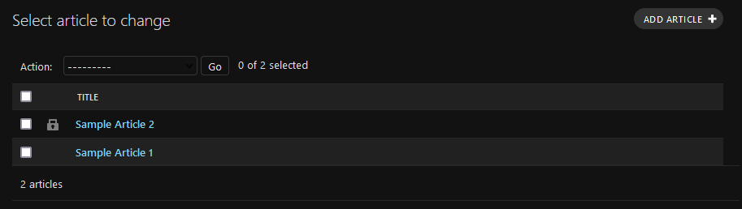

# Django Object Lock documentation

>   Oops! I think I've edited the wrong object.
>   
>   We don't need to edit this any longer. I wish I could prevent this object from being edited anymore...

**Django Object Lock** (`django-admin-lock`) adds a "locked" status to your models to prevent their unintentional
modification or deletion from your Django admin site, your API or any view. You can "lock" an instance to protect it
and then "unlock" it to allow further modifications or deletions.

```{toctree}
:maxdepth: 1

installation
demo
model-locking
admin-locking
api-locking
settings
changelog
```

## Features

*   A lock icon will appear in the changelist for each locked instance.

    

    The detail page for a locked object will be read-only.

    

*   This "locked" status may be set manually (adding a field for your users to lock or unlock the object) or
    automatically (locking objects depending on a condition).

    For example, you can have a parent model that can be locked setting manually a Boolean field and a child model
    that will be automatically locked or unlocked whenever its parent is.

    

    This way, you can lock and unlock entire hierarchies of model instances.

## Support

`django-admin-lock` supports the following versions of Python and Django:

*   Python >= 3.6
*   Django >= 3.0
*   Django REST Framework >= 3.11 (to enforce object locking from your API `ViewSet`s)
